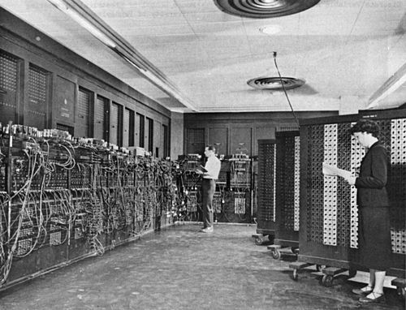

Docker Article Title, by John Fink

----

If you were working in library IT in the last millenium, you'll likely remember what the server rooms of those times looked like -- PC towers running Novell Netware attached to huge multi-disc CDROM arrays, refrigerator-sized Sun boxes, Digital AlphaServers running INNOPAC. To run most of the serious business of libraries, you needed serious equipment to go with them. Machine rooms were jumbled messes of shelves, wires and air conditioning units. With the advent of Linux running on microcomputers, these rooms got slightly smaller and maybe slightly less complex, but it wasn't until the early 2000s that the real sea change came for the server room -- the rapid adoption of easily implementable virtualization.

Although virtualization in the modern sense actually happened as early as 1972 with VMs for IBM System/360[CITE] it wasn't until 2001 when VMWare introduced its x86 virtualization that virtualization in the Linux space really took off, and technologies like Amazon Web Services and the OpenStack framework.

This is an 

